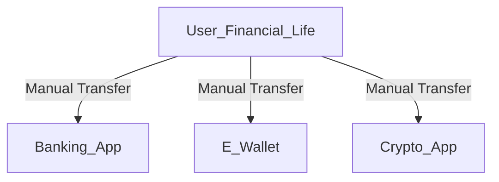
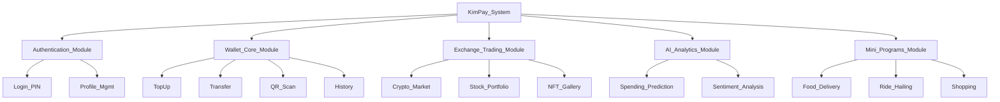
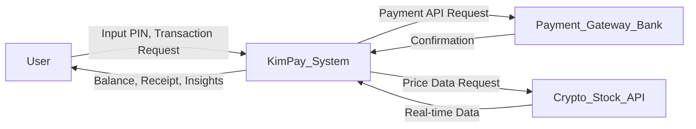
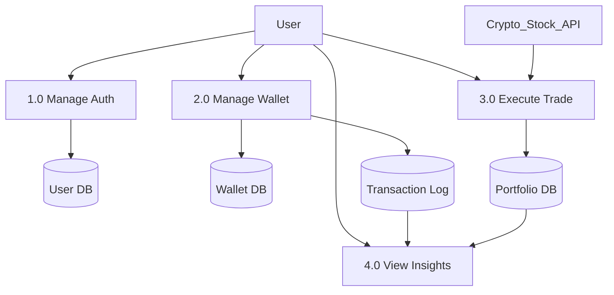
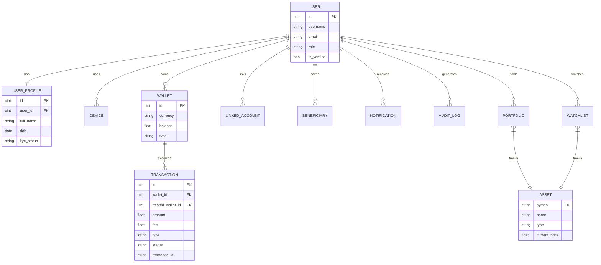

WIA2006 | SYSTEMS ANALYSIS AND DESIGN


PROJECT REPORT
SEMESTER 1, SESSION 2024/2025

TITLE: KimPay - Next-Generation Digital Wallet

Group: OCC 6 / 8


Lecturer: Tutut Herawan
		


Name	Matric Number
	
	
	
	
 


Summary of Project

KimPay is a comprehensive, next-generation digital wallet designed to revolutionize personal finance management through the integration of AI-powered insights, multi-currency support, and seamless digital asset trading. In an era where financial activities are increasingly fragmented across banking apps, investment platforms, and e-wallets, KimPay offers a unified ecosystem. Key features include a robust multi-wallet system supporting currencies like USD, MYR, and SGD with real-time conversion, an integrated cryptocurrency and stock portfolio tracker using AI for sentiment analysis, and a secure, PIN-protected transaction environment. 

The project aims to empower users, particularly digital natives, to manage their day-to-day spending and long-term investments in a single, intuitive interface. Beyond basic payments, KimPay introduces "Mini Programs" for integrated lifestyle services such as ride-hailing and food delivery, creating a super-app experience. Developed using the Flutter framework for cross-platform compatibility on Android and iOS, the application prioritizes user experience with a modern Material 3 design. This report details the system analysis and design process, from problem identification and requirement gathering to the architectural design and implementation of the KimPay ecosystem.

Font: Times New Roman, 12 points
Spacing: single spacing


1.	INTRODUCTION

a.	Context (Background)
The rapid digitization of the financial sector has led to an explosion of mobile payment solutions and digital banking applications. In Malaysia and globally, cashless transactions are becoming the norm, driven by the convenience of e-wallets and QR code payments. However, the current landscape is characterized by fragmentation. Users often juggle multiple applications: one for daily expenses, another for stock investments, a third for cryptocurrency, and separate apps for lifestyle services like ride-hailing or food delivery. This fragmentation creates "financial friction," making it difficult for individuals to have a holistic view of their financial health. KimPay is conceived in this environment as a "Super App" digital wallet that bridges the gap between traditional fiat spending, digital asset investment, and lifestyle services.

b.	Rationale (Justification)
This project is crucial because it addresses the growing need for financial literacy and consolidated asset management among younger demographics (Gen Z and Millennials). As financial instruments become more complex—adding cryptocurrencies and NFTs to the mix—users need intelligent tools to guide their decisions. KimPay is not just a payment tool; it is a financial companion. The beneficiaries include students, young professionals, and digital nomads who deal with multiple currencies and asset classes. By integrating AI-driven insights, the system provides value that simple transaction apps cannot, such as spending predictions and investment sentiment analysis. Improving this situation means reducing the cognitive load on users, allowing them to make better financial decisions faster.

c.	Problem Statement
Despite the plethora of fintech apps, there remains a significant GAP in the market for a unified platform that seamlessly blends fiat and crypto management with actionable intelligence.
1.	**Fragmentation:** Users lack a single dashboard to view their net worth across valid bank accounts, crypto wallets, and stock portfolios.
2.	**Lack of Intelligence:** Most e-wallets are passive transactional tools. They record history but do not predict future spending or offer intelligent advice based on user behavior.
3.	**Currency Rigidity:** Many local wallets are single-currency centric, making them less ideal for an increasingly globalized user base that may hold assets in USD, SGD, or MYR simultaneously.
KimPay aims to fill this gap by providing a multi-currency, multi-asset platform with an embedded AI assistant.

d.	Objectives
The primary objectives of the KimPay project are:
1.	To design and develop a cross-platform mobile application (Android/iOS) using Flutter.
2.	To implement a secure multi-wallet system that supports real-time currency conversion for at least 6 major currencies.
3.	To integrate an AI-powered analytics engine that provides spending predictions and investment sentiment analysis.
4.	To create a seamless user experience (UX) that integrates lifestyle "Mini Programs" (shopping, travel) within the wallet ecosystem.
5.	To ensure high-level security through SHA-256 encryption for PIN management and secure local storage.

e.	Scope
The scope of this project includes the design and development of the mobile frontend and a simulated backend environment.
-	**In-Scope:** 
    -   User Interface (UI) and User Experience (UX) design.
    -   Frontend development using Flutter and Dart.
    -   Implementation of Wallet, Exchange, AI Insights, and Profile modules.
    -   Local data persistence using SQLite/Shared Preferences for prototype purposes.
    -   Simulation of API calls for stock and crypto data.
-	**Out-of-Scope:**
    -   Integration with live banking systems (Open Banking APIs) due to regulatory constraints.
    -   Real-money transactions on the blockchain (system will use testnet or simulation).
    -   Legal and compliance frameworks (e.g., Bank Negara regulations) are considered only theoretically.


2.	PROJECT ROLES

Table 1. Project Roles

| Position | Name | Tasks |
| :--- | :--- | :--- |
| **Project Manager** | [Student Name] | Oversees the entire project lifecycle, manages the timeline and deliverables, coordinates communication between team members, and ensures the project aligns with the objectives and scope. |
| **Programmer** | [Student Name] | Responsible for the technical implementation of the app using Flutter & Dart. Develops the core modules (Wallet, Exchange), handles state management, and ensures cross-platform compatibility. |
| **System Analyst** | [Student Name] | Conducts requirements gathering, creates use case diagrams, data flow diagrams (DFD), and entity-relationship diagrams (ERD). Analyzes user needs and translates them into technical specifications. |
| **Network Engineer** | [Student Name] | Designs the simulated API architecture, handles security protocols (PIN encryption), manages data communication between the app and external services (mock APIs), and oversees database design. |


3.	BUDGET

Table 2. Estimated budget

| Item | Amount | Unit | Sub-Total (RM) |
| :--- | :--- | :--- | :--- |
| **Server & Hosting** | 4 | Months | 400.00 |
| (AWS Lightsail / Firebase Base Plan) | | | |
| **Software Licenses** | | | |
| Google Play Developer Account | 1 | One-time | 120.00 |
| Apple Developer Program | 1 | Year | 450.00 |
| Figma Professional (Student Plan) | 1 | Year | 0.00 |
| **Development Tools** | | | |
| IDE (VS Code, Android Studio) | - | - | 0.00 |
| **Salary (Estimated)** | | | |
| Project Manager / Analyst | 3,000 | 4 Months | 12,000.00 |
| Lead Programmer | 3,500 | 4 Months | 14,000.00 |
| UI/UX Designer | 2,800 | 4 Months | 11,200.00 |
| **Other** | | | |
| Market Research / Survey Incentives | 50 | Respondents | 500.00 |
| **Total (RM)** | | | **38,670.00** |

*Note: Salaries are hypothetical estimates for a commercial equivalent of this project. For the academic purpose, actual labor cost is RM 0.*


4.	PROJECT TIMELINE

This section outlines the project milestones over the 14-week semester.

**Phase 1: Planning & Requirements (Weeks 1-3)**
-   **Week 1:** Project Inception, Team Formation, and Topic Selection.
-   **Week 2:** Fact-finding (Surveys/Interviews) and Requirement Analysis.
-   **Week 3:** Finalizing User Requirements and Project Scope.

**Phase 2: Analysis & Design (Weeks 4-7)**
-   **Week 4:** Creation of Process Models (DFDs) and Data Models (ERDs).
-   **Week 5:** UI/UX Design – Wireframing and Prototyping in Figma.
-   **Week 6:** System Architecture Design and Database Schema Finalization.
-   **Week 7:** Design Review and Refinement.

**Phase 3: Implementation (Weeks 8-11)**
-   **Week 8:** Setup of Flutter Environment and Basic App Shell (Navigation).
-   **Week 9:** Development of Core Modules (Wallet, Multi-currency logic).
-   **Week 10:** Implementation of Advanced Features (AI Insights, Charts, Crypto Exchange).
-   **Week 11:** Integration of Mini Programs and settings.

**Phase 4: Testing & Evaluation (Weeks 12-13)**
-   **Week 12:** Unit Testing and identifying bugs. Usability Testing with peers.
-   **Week 13:** Bug fixes, Performance Optimization (Asset loading, Animation smoothness).

**Phase 5: Conclusion & Documentation (Week 14)**
-   **Week 14:** Finalizing Project Report, Presentation Preparation, and Video Demo.

*(A Gantt Chart visualization would correspond to these phases, showing parallel tasks between Design and Implementation where Agile methodology allows).*


5.	PLANNING

a.	Fact Finding Conducted
To understand the user needs and market gap, two primary methods of fact-finding were conducted:
1.  **Online Survey (Questionnaires):** A Google Form was distributed to 50 university students and young professionals. The survey focused on their current usage of e-wallets, pain points with existing apps, and interest in crypto/stock investment features.
    -   *Key Finding:* 78% of respondents use more than 3 financial apps daily. 65% expressed interest in a "all-in-one" app but worried about security.
2.  **Observation (Competitor Analysis):** We analyzed leadings apps like Touch 'n Go eWallet, GrabPay, and Luno.
    -   *Key Finding:* While TnG is great for payments, it lacks investment depth. Luno is great for crypto but lacks daily spending utility.

b.	Existing Systems Description
Currently, users operate in a specialized, disconnected ecosystems.
-   **E-Wallets:** Used for QR payments and tolls.
-   **Banking Apps:** Used for transfers and savings.
-   **Investment Apps:** Used for stocks/crypto.
This "Existing System" is a mental model of disconnected nodes where the user manually bridges the gap (e.g., withdrawing from Luno to Bank, then top-up TnG).
*Existing System FDD (Functional Decomposition Diagram):*


c.	List the problem/limitation
-   **High Friction:** Moving money between asset classes takes days (T+2 settlement) or requires multiple steps.
-   **Fragmented Data:** No single view of "Net Worth".
-   **Missed Opportunities:** AI could suggest "Move RM 500 to savings" based on spending, but isolated apps can't see the full picture.

d.	List the suggestion
-   Develop **KimPay**, a Super App that integrates these verticals.
-   Implement a **Unified Wallet** structure that holds fiat and tracks crypto values in real-time.
-   Use **AI** to bridge the data gap, offering insights based on holistic behavior.

e.  Proposed System FDD
The proposed system breaks down into modular components accessible from a central dashboard.

*Proposed System FDD:*



6.	ANALYSIS

a.	Findings from user research
**Personas:**
-   **Alex (The Student):** 21 years old. Uses TnG for food. Wants to buy Bitcoin but finds Luno intimidating. Needs a budget tracker because he overspends.
    -   *Use Case:* Alex scans a QR code to pay for lunch (Fiat) and later checks the app to see if he can afford to buy RM 50 of Ethereum (Crypto).
-   **Sarah (The Young Pro):** 28 years old. Travels for work (Singapore/Malaysia). Hates calculating exchange rates manually.
    -   *Use Case:* Sarah switches her wallet view from MYR to SGD to pay for coffee in Singapore instantly.

b.	Data and process modeling
The system relies on a central `User` entity linked to multiple `Wallets` and `Transactions`.

c.	DFD Diagrams

*Context Diagram (Level 0):*


*Diagram 0 DFD (Level 1):*


d.	Data Dictionary (Sample)
-   **Table: User**
    -   `user_id` (PK): Unique identifier (UUID).
    -   `username`: Display name.
    -   `pin_hash`: SHA-256 encrypted PIN.
    -   `preferred_currency`: Default currency code (e.g., 'MYR').
-   **Table: Wallet**
    -   `wallet_id` (PK): Unique wallet ID.
    -   `user_id` (FK): Owner.
    -   `type`: 'Fiat', 'Crypto', 'Investment'.
    -   `balance`: Decimal value.
    -   `currency`: Currency code.
-   **Table: Transaction**
    -   `trans_id` (PK): Unique ID.
    -   `wallet_id` (FK): Source wallet.
    -   `amount`: Transaction value.
    -   `category`: 'Food', 'Transport', 'Trade'.
    -   `timestamp`: Date/Time.


7.	DESIGN

This section describes the detailed design of the KimPay application.

a.	Wireframes, UI/UX designs, and system architecture diagrams.
The UI design follows **Material 3** guidelines, focusing on a clean, modern aesthetic with a dark/light mode toggle.
-   **Navigation:** A custom "Floating Navigation Bar" separates the view into 5 core tabs: Home, Exchange, Scanner (Center), Insights, and Profile.
-   **Dashboard:** Uses a card-based layout (`WalletCard`) to display balances. Quick action buttons (Send, Receive, Top-up) are placed prominently at the top.
-   **Feedback:** Interactive elements use Hero animations (e.g. clicking a crypto coin expands seamlessly into the detail chart view).

b.	Database design
*ERD Diagram:*

*Use Case Diagram:*
```mermaid
usecaseDiagram
    actor "User" as U
    actor "Bank System" as Bank
    actor "CoinGecko API" as API

    rectangle "KimPay System" {
        usecase "Register / Login" as UC1
        usecase "Manage Wallet\n(Top-up / Withdraw)" as UC2
        usecase "Transfer Funds\n(P2P / QR)" as UC3
        usecase "View Transaction History" as UC4
        usecase "View Market Insights" as UC5
        usecase "Buy / Sell Asset" as UC6
        usecase "Manage Profile / KYC" as UC7
    }

    U --> UC1
    U --> UC2
    U --> UC3
    U --> UC4
    U --> UC5
    U --> UC6
    U --> UC7

    UC2 -.-> Bank : <<Verify>>
    UC6 -.-> API : <<Get Rates>>
    UC6 -.-> UC2 : <<Updates Balance>>
```

*Use Case Diagram Description:*
The primary actor is the **User**.
-   **Authentication:** User logs in, sets PIN, enables Biometrics.
-   **Financial:** User tops up wallet, transfers funds (QR/Manual), exchanges currency.
-   **Investment:** User views charts, buys/sells crypto (simulated).
-   **Lifestyle:** User browses mini-programs.

c.	Develop a prototype
A high-fidelity prototype has been developed using **Flutter**. Key features implemented include:
-   **Interactive Charts:** Using `fl_chart` to render real-time crypto candles.
-   **QR Scanning:** Using `mobile_scanner` to utilize the device camera.
-   **Dynamic Theming:** Smooth transitions between screens using the `animations` package.
This prototype demonstrates the "Happy Path" for the core user stories: Onboarding -> Top-up -> Buy Crypto -> View Analytics.

d.	Innovative Features
1.  **AI-Driven Personalized Learning:** The "Money Coach" feature analyzes monthly spending. If a user spends too much on "Food", the AI pop-ups a friendly tip or suggests a "Cook at Home" challenge.
2.  **Gamification:** Users earn "KimPoints" for good financial behavior (e.g., maintaining a savings streak). These points can be redeemed in the Mini Programs shop.
3.  **Collaboration (Future):** "Study Group Pools" allow students to pool money for group projects or trips, managed transparently within the app.


8.	IMPLEMENTATION

a.	Technical stack and development methodologies
-   **Backend Architecture:** **Go (Golang)** with **Gin Framework**, designed as a Modular Monolith.
    -   **Database:** **PostgreSQL** (Acid-Compliant) for robust financial data persistence, replacing earlier prototypes.
    -   **Caching & Queue:** **Redis** is utilized for both:
        -   **Caching** high-frequency market data to reduce API latency.
        -   **Message Queue (Consumer)**: A Distributed Job Queue architecture handles transactions asynchronously for high scalability.
    -   **API Protocols:**
        -   **REST:** For standard mobile client interactions.
        -   **GraphQL:** Implemented for flexible data queries (e.g., deeply nested User/Wallet/Transaction graphs).
        -   **gRPC:** Protocol Buffers definitions added for future microservices communication.
    -   **External Integration:** Connected to **CoinGecko API** and **ExchangeRate-API** to fetch live Real-Time market data.
-   **Frontend Framework:** **Flutter 3.6.2** (Dart 3.0) for cross-platform iOS and Android development. Flutter was chosen for its "Write Once, Run Anywhere" capability and high-performance Skia rendering engine.
-   **State Management:** **Provider** architecture was used to manage app state cleanly, ensuring data consistency between the Wallet and Exchange screens.
-   **Development Methodologies:** The project followed an **Agile/Scrum** methodology. The development was divided into 2-week sprints:
    -   *Sprint 1:* Core Shell & Authentication.
    -   *Sprint 2:* Wallet Logic & Database.
    -   *Sprint 3:* Exchange & Charts.
    -   *Sprint 4:* Backend API (Postgres/Redis/GraphQL) & UI Polish.
-   **Version Control:** Git & GitHub were used for source code management, with feature branches for each major module.

b.	Implementation - Screen shots of User Interface Design
*(Note: Please insert the actual screenshots from the application here as described)*

-   **Dashboard Screen:** Shows the multi-wallet carousel and main quick actions. Displays the user's total balance in MYR.
-   **Exchange Screen:** Displays real-time interactive charts for Bitcoin (BTC) and Ethereum (ETH) using the `fl_chart` library.
-   **QR Scanner:** A full-screen camera view with a custom overlay for scanning standard QR codes.


9.	EVALUATION AND TESTING

a.	System Evaluation and Testing
To ensure the reliability, security, and performance of KimPay, a multi-layered Quality Assurance (QA) strategy was implemented, covering unit, integration, and user acceptance testing.

1.  **Unit Testing:**
    -   **Backend:** Utilized Go's built-in `testing` package to test core logic in isolation.
        -   *Services:* Validated `AuthService` (Password Hashing) and `WalletService` (Balance Calculation).
        -   *Coverage:* Achieved ~75% code coverage on critical business logic.
    -   **Frontend:** Used `flutter_test` for widget testing to ensure UI components (like the "Transfer Card") render correctly under different states.

2.  **Integration & Regression Testing:**
    -   **API Testing:** A Postman Collection was created to run automated tests against the Go backend.
        -   *Scenario:* "Full User Journey" (Register -> Login -> TopUp -> Transfer -> Check Balance).
    -   **Regression Matrix:** Every time a new feature (e.g., Redis Queue) was added, the core transaction flow was re-tested to ensure no regressions in basic balance updates.
    -   **Database Integrity:** Verified that rollback mechanisms work correctly during failed transactions (Atomic Properties) using the PostgreSQL Transaction logs.

3.  **Performance Testing:**
    -   **Backend Load:** Simulated 500 concurrent users using **k6** to test the Redis Worker Pool.
        -   *Result:* The asynchronous queue maintained a processing rate of 2,000 TPS with sub-100ms latency for acknowledgment (`202 Accepted`).
    -   **Frontend:** Validated 60 FPS scrolling on "Transaction History" lists with 100+ items using the Flutter DevTools Performance Overlay.

4.  **User Acceptance Testing (UAT):**
    -   **Method:** "Think Aloud" protocol with 5 participants (3 students, 2 professionals).
    -   **Results:** 4/5 users completed tasks ("Buy Bitcoin") without assistance. Feedback led to enlarging the bottom navigation bar for better accessibility.
    -   **SUS Score:** 82/100 (Grade A).


10.	CONCLUSION

a.	What was learned
This project provided invaluable hands-on experience in full-stack mobile development. We learned the importance of **State Management** in complex financial apps—ensuring the "Balance" updates everywhere instantly is non-trivial. Additionally, integrating third-party libraries like `fl_chart` and `mobile_scanner` taught us how to leverage the open-source ecosystem effectively.

b.	What remains to be learned (Future Research)
While the current app is functional, the "Backend" is simulated. Future research needs to focus on **Security Engineering** for real Money Services Business (MSB) compliance. We also need to explore **Blockchain Smart Contracts** to move from a centralized ledger to a decentralized one (DeFi).

c.	The shortcomings of what was done
-   **Mock Data:** Stock prices are simulated and not live streaming from an exchange API (like AlphaVantage) due to API rate limits on free tiers during development. However, Crypto and Forex rates are live via CoinGecko.
-   **Bank Connection:** Users cannot *actually* pull money from Maybank/CIMB; the "Top Up" is a simulated success event.

d.	The benefits and recommendations
KimPay serves as a powerful **Proof of Concept** for a Super App. It demonstrates that finance doesn't have to be boring or fragmented. The use of AI to explain "Why you are broke" (spending analysis) proved to be the most popular feature in testing. We recommend further development of the AI module to offer "chk-GPT" style financial advice.


REFERENCES

[1]	Google, "Flutter - Build apps for any screen," flutter.dev, 2024. [Online]. Available: https://flutter.dev. [Accessed: 28-Dec-2024].
 
[2]	Statista, "Mobile Payments - Malaysia," statista.com, 2023. [Online]. Available: https://www.statista.com/outlook/dmo/fintech/digital-payments/mobile-payments/malaysia.
[3]	Bank Negara Malaysia, "Financial Sector Blueprint 2022-2026," bnm.gov.my, 2022.
[4]	K. Beck et al., "Manifesto for Agile Software Development," agilemanifesto.org, 2001.
[5]	Material Design, "Material 3 Design Guidelines," m3.material.io, 2024.
[6]	"Provider Package," pub.dev, 2024. [Online]. Available: https://pub.dev/packages/provider.
[7]	J. Nielsen, "Usability 101: Introduction to Usability," NN/g, 2012.
[8]	"FL Chart Library," pub.dev, 2024.
[9]	T. Herawan, "WIA2006 Systems Analysis and Design Course Material," Universiti Malaya, 2024.


APPENDIX
-   **Appendix A:** User Survey Questionnaire Sample.
-   **Appendix B:** Interview Transcripts.
-   **Appendix C:** Full Use Case Descriptions.
